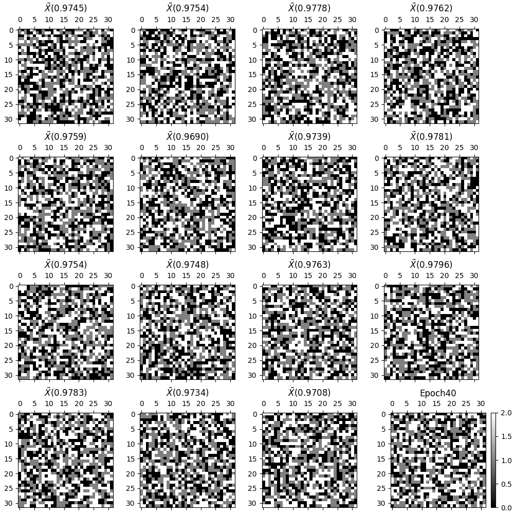

<head>
<!--  -->
<!-- uncomment two lines above and remove the html css to svg lines -->

</head>
$$
 \def\tr#1{\text{Tr}\left[ #1 \right]}
 \def\Efunc#1{\mathPbb{E}\left[ #1\right]}
 \def\Efuncc#1#2{\mathbb{E}_{#1}\left[ #2 \right]}
 \def\red#1{\textcolor{red}{#1}}
 \def\blue#1{\textcolor{blue}{#1}}
 \newcommand\scalemath[2]{\scalebox{#1}{\mbox{\ensuremath{\displaystyle #2}}}}
$$

