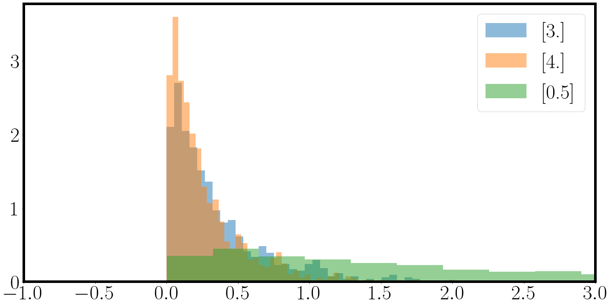
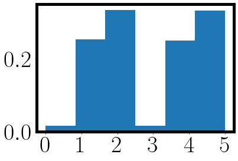
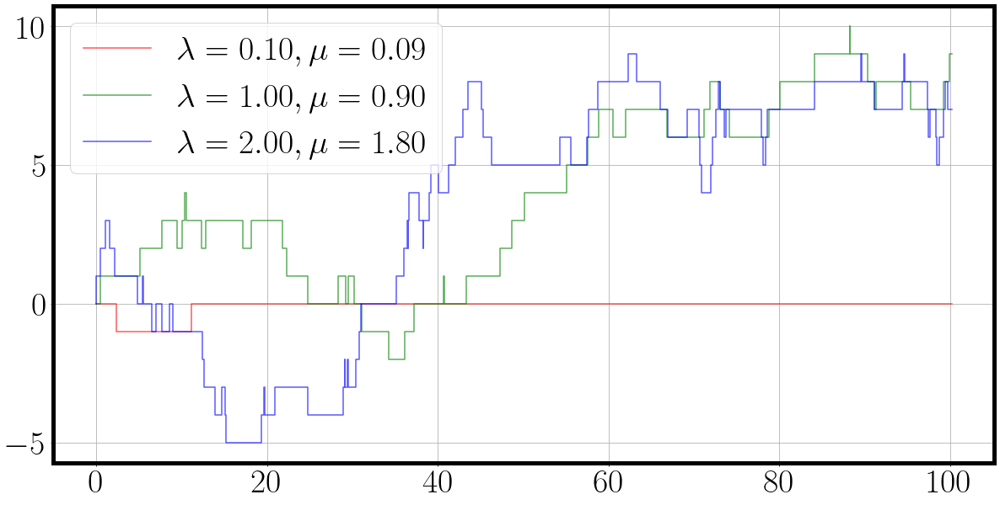
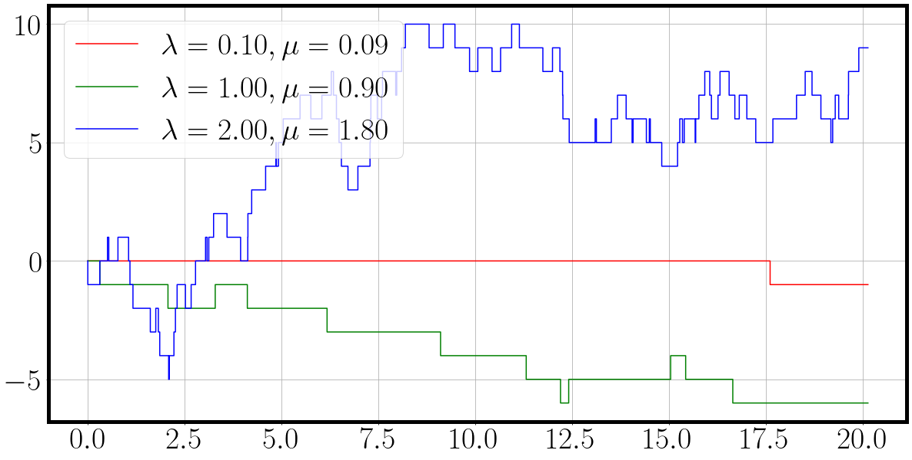
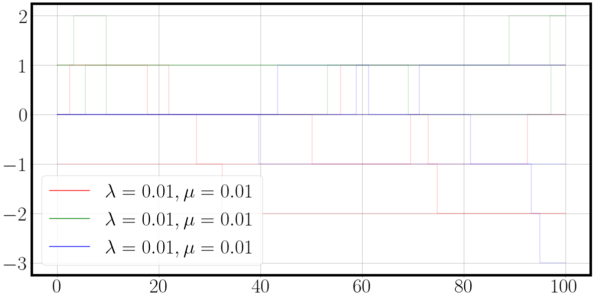
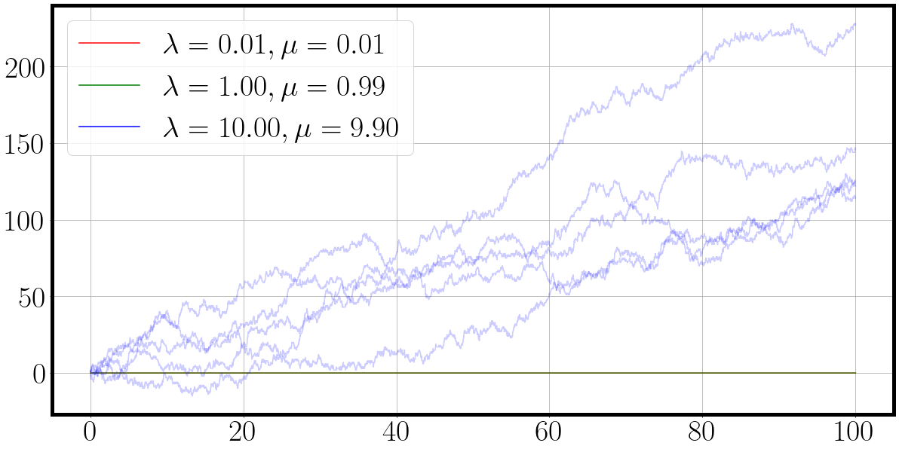
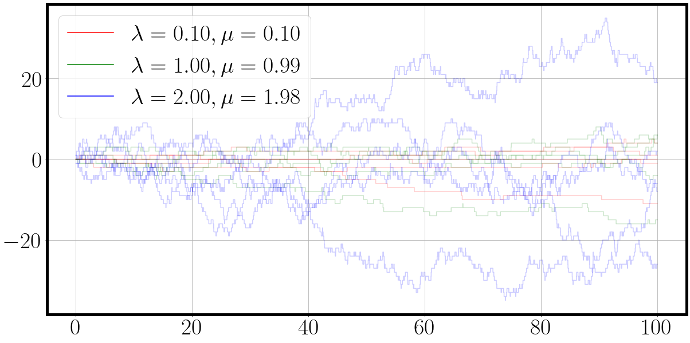
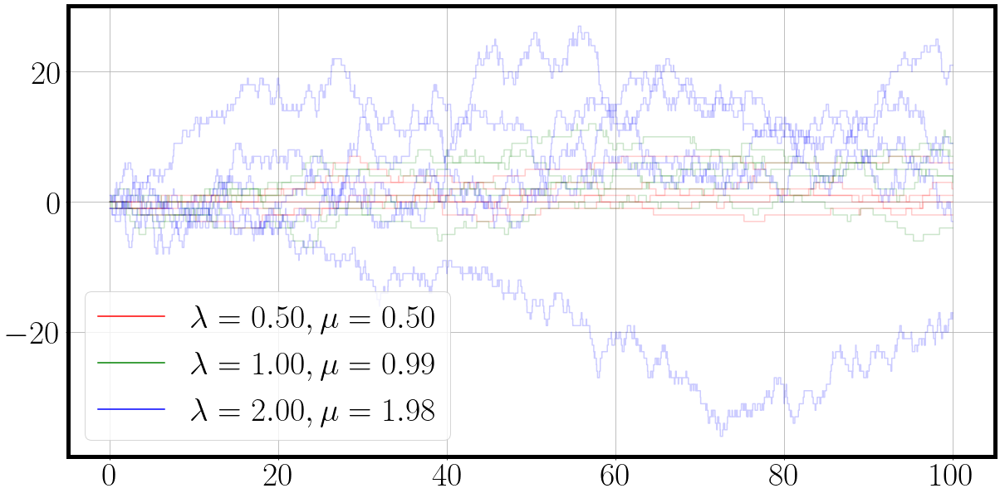

<head>
<script type="text/x-mathjax-config"> MathJax.Hub.Config({ TeX: { equationNumbers: { autoNumber: "all" } } }); </script>
       <script type="text/x-mathjax-config">
         MathJax.Hub.Config({
           tex2jax: {
             inlineMath: [ ['$','$'], ["\\(","\\)"] ],
             displayMath: [['$$','$$']],
             processEscapes: true
           }
         });
       </script>
       <script src="https://cdn.mathjax.org/mathjax/latest/MathJax.js?config=TeX-AMS-MML_HTMLorMML" type="text/javascript"></script>
</head>
$$
 \def\tr#1{\text{Tr}\left[ #1 \right]}
 \def\Efunc#1{\mathbb{E}\left[ #1\right]}
 \def\Efuncc#1#2{\mathbb{E}_{#1}\left[ #2 \right]}
$$

### Continuous Time Markov Chains

A continuous-time Markov chain (CTMC) is a mathematical model that describes the evolution of a system over time, where the state of the system changes according to a set of probabilities at each point in time. 
Like a discrete-time Markov chain, a CTMC consists of a set of states and a set of transitions between those states. 
However, in a CTMC, the transitions between states can occur at any point in time, rather than only at discrete time steps.

A CTMC is defined by its generator matrix, which describes the rate at which the system transitions between states. 
The elements of the generator matrix are typically denoted by $Q_{ij}$, where $Q_{ij}$ is the rate at which the system transitions from state $i$ to state $j$.
These rates denote the intensity $\lambda$ of exponentially distributed random variables.
The diagonal elements $Q_{ii}$ denote the rate with which we will stay in state $i$, whereas $Q_{ij}, i \neq j$ denotes the rate of changing from state $i$ to $j$.
Whereas discrete time markov chains have transition probabilities in form of the matrix $P_{ij}$ for discrete time steps, CTMC are a bit more involved by changing continuously in time $t$ and change states according to $P(t)$.

But how are the rates $Q_{ij}$ and the transition matrix $P_{ij}(t)$ connected?
The 'generator' in generator matrix $Q$ comes from $Q$'s property of containing the instantaneous rate of change for an infinitesimally small change in time.
The rate describes the instantaneous propensity or affinity for the process to transition between its states.
If we know how the instantaneous behaviour of the stochastic process is, we can 'generate' entire trajectories of it.

Each entry $P_ij(t)$ denotes the probability of transitioning from state $i$ to state $j$ dependent on the time $t$ that has passed.
This ergodicity is due to the Markov property that treats each transition independently from all previous.
For $t=0$ we get $P(0)=I$ as we will surely stay in the same state $i$ since no time has passed.
If no time has passed, we concurrently didn't have time to transition.

Thus $Q$ and $P(t)$ are connected via
$$
\begin{align}
  Q = \lim_{t \rightarrow 0^+} \frac{P(t)- I}{t} = \lim_{t \rightarrow 0^+} \frac{P(t)- P(0)}{t}.
\end{align}
$$

Each row of $P(t)$ has to sum up to 1, namely $\sum_j P_{ij}(t) = 1$. 
Another intriguing property of the generator matrix $Q$ is that the diagonal terms are negative.
To see why we can construct a simple example by looking at the first row $i=1$ after one unit of time has passed, $P_{i=1}(t=1) = [0.8, 0.1, 0.1]$.
Plugging it into the limit (albeit be it with $t=1$), we get 
$$
\begin{align}
  Q = P(1) - I = [0.8, 0.1, 0.1] - [1, 0, 0] = [-0.2, 0.1, 0.1].
\end{align}
$$

Taking this to the limit of $\lim t \rightarrow 0^+$ and seeing that the identity matrix only subtracts from the diagonal elements, we can conclude that the diagonal elements $Q_{ii}$ are in effect negative and the negative sum of the off-diagonal terms in each row, $Q_{ii} = - \sum_{i \neq j} Q_{ij}$.
We can thus interpret the absolute value of the diagonal terms $Q_{ii}$ as the rate of staying in the state $i$, whereas all other rates determine the rate of changing to a different state $j$.

Computing the limit $\lim t \rightarrow 0^+$ gives us the rates of the exponentially distributed holding times in each state.
The exponential distribution models the time between events in a Poisson point process, explained on the blog [here](https://ludwigwinkler.github.io/blog/Poisson/).
Thus given a rate $\lambda$ which is given by the elements in the matrix $Q$, we have multiple competing exponentially distributed random variables.
The question now arises what transition will occur first.

Conveniently, we can ask a different question and split the problem into two subproblems, namely 'How long will we stay in $i$?' and 'Once we exit state $i$, where do we go?'.

The first question can be answered by observing what the probability is, that *any* process activates.
Any means here simply the minimum that any process changes, namely $\min{X_1, X_2, X_3}$.
Each off-diagonal entry $\lambda_j$ denotes the rate of an independent exponentially distributed random variable $\tau_j \sim \text{Exp}[\lambda_j]$.
Thus we are interested in the probability of how the minimum of all holding times $\tau_j$ is distributed vis-a-vis being larger than some aggregated holding time $t$.
For that we can employ the complementary cumulative density function (cCDF = 1-CDF so not standard CDF $p(\tau_i < t)$ but $p(\tau_i > t)$ lying outside of $t$) of the exponential distribution and ask whether $p(\tau_i > t)$:
$$
\begin{align}
  p(\min \{ \tau_1, \tau_2, \tau_3 \} > t) &= p(\tau_1 > t, \tau_2 > t, \tau_3 > t) \\
  &= \prod_{i=1}^3 p(\tau_i > x) \\
  &= \prod_{i=1}^3 \overbrace{1 - \underbrace{(1 - \exp[-\lambda_i x])}_{\text{Exp CDF}}}^{\text{Exp cCDF}} \\
  &= \prod_{i=1}^3 \exp[-\lambda_i x] \\
  &=  \exp \left[- \sum_{i=1}^3 \lambda_i x \right]
\end{align}
$$

Thus the minimum holding time is again an exponential distribution with the rate $\sum_i \lambda_i$.
Once the holding time is 'exhausted' or has passed, we have to determine the second question, namely which process is going to occur next.
Therefore we want to know the probability
$$
\begin{align}
  p(i = \text{argmin}_i \{ \tau_1, \tau_2, \tau_3 \}) &= \int_0^\infty p(\tau_i = t) \ p(\forall_{k \neq i} \tau_k > t) dt \\
\end{align}
$$

which states that our $i$ in question is precisely the holding time $t$ and factorizing via conditional independence that every other exponentially distributed holding time $\tau_k$ is larger than $t$ which is again the cCDF.
Finally we marginalize over $t$ to incorporate the fact the holding time $t$ is itself a random variable which ought to be marginalized out, effectively taking into account every possible value of $t$.
We obtain
$$
\begin{align}
  p(i = \text{argmin}_i \{ \tau_1, \tau_2, \tau_3 \}) 
  &= \int_0^\infty p(\tau_i = t) \ p(\forall_{k \neq i} \tau_k > t) dt \\
  &= \int_0^\infty \underbrace{p(\tau_i = t)}_{\text{Exp}} \ \underbrace{p(\forall_{k \neq i} \tau_k > t)}_{\text{cCDF}} dt \\
  &= \int_0^\infty \lambda_i \exp[-\lambda_i t] \ \prod_{k \neq i} \exp[- \lambda_k t] dt \\
  &= \int_0^\infty \lambda_i  \ \prod_{k} \exp[- \lambda_k t] dt \\
  &= \lambda_i \int_0^\infty  \ \exp \left[- \sum_{k} \lambda_k t \right] dt \\
  &= \lambda_i  \left[ - \frac{\exp \left[- \sum_{k} \lambda_k t \right]}{\sum_{k} \lambda_k} \right]_0^\infty \\
  &= \lambda_i  \left(  0 + \frac{1}{\sum_{k} \lambda_k} \right) \\
  &= \frac{\lambda_i}{\sum_{k} \lambda_k} \\
\end{align}
$$

Thus we can conclude that the process that 'acts first' is $i \sim \text{Cat}[\lambda_1, \lambda_2, \lambda_3]$.
We can thus devise a sampling algorithm based on rates $\lambda_i$ which first samples holding time $t \sim \text{Exp}[\sum_i \lambda_i]$ and after the holding time samples the next state as $i \sim \text{Cat}[\lambda_i]$.

### Birth-Death Process

A birth-death process is a stochastic process $\\{X_t\\}_{t \in \mathbb{R}^+}$ with $X_t = X_t^\lambda - X_t^\mu$ with two 'duelling' rates: the birth rate $\lambda$ and the death rate $\mu$.
Both rates induce a counting process (albeit be it with opposite signs) such that the infinitissimal generators are
$$
\begin{align}
\lim_{h \rightarrow 0^+} P(X_{t+h} = X_t + 1 | X_t) &= \lambda h \\
\lim_{h \rightarrow 0^+} P(X_{t+h} = X_t - 1 | X_t) & = \mu h \\
\lim_{h \rightarrow 0^+} P(X_{t+h} = X_t + 0| X_t) & = 1- (\lambda + \mu) h
\end{align}
$$

the derivation of which can be followed up [here](https://ludwigwinkler.github.io/blog/Poisson/).

We can thus construct a straight forward sampling algorithm by sampling the holding time $\tau$ in state $X_{t+\tau} = X_t$ with $\tau \sim \text{Exp}[ \lambda + \mu]$ and once the holding time is over, sampling either the death or the birth process with $\{+1, -1\} \sim \text{Cat}[\lambda, \mu]$.

Sampling from the exponential distribution can be easily done with inverse transform sampling by first sampling $u \sim U[0,1]$ and using 
$$
\begin{align}
u &= \text{ExpCDF}(x, \lambda) \\
u &= 1 - \exp[-\lambda x] \\
\underbrace{1 - u}_{=u'} &= \exp[-\lambda x] \\
\log u' &= -\lambda x \\
-\frac{1}{\lambda} \log u' &= x \\
\end{align}
$$

where we used the fact that $u' = 1 - u \sim U[0,1]$ is again a uniformly distributed random variable.

### Jax

If you haven't been living under a proverbial analog rock in the digital machine learning space, you might have heard of [Jax](https://github.com/google/jax).
At the core of Jax are four function transforms with three to four letters: `grad`, `jit`, `vmap` and `pmap`.

`grad` traces a function when it's called the first time and transforms that function by replacing the operations in the function with its derivatives with respect to the input

`jit` adds a just-in-time compilation function transform which aims at compiling an optimized version of your given function.
Python is an interpreted language which does executes every instruction without anticipating the future.
After having traced through a `jit` marked function for the first time, Jax will know what the whole execution of the function will entail.
Since it knows all the operations, it will upon finishing the first evaluation of the function start compiling it fusing operations and removing unneeded data copying for example (this is a very broad example).
Obviously this entails some programming restrictions which can be read up in the [Jax - The Sharp Bits](https://jax.readthedocs.io/en/latest/notebooks/Common_Gotchas_in_JAX.html).
You have to essentially live with a few restrictions and in order to ensure deterministic function evaluations the random key has to passed to stochastic functions, rendering the deterministic given the random number generator key.

`vmap` is in my opinion the true power move of Jax by allowing to replicate the same function over an extra dimension.
You can write a possibly very complicated function for a single data point and simply vmap over to enable it to evaluate the function over batches of data points in parallel.
No more extra dimensions, no more custom forward passes changing every matrix-vector to a matrix-matrix operation etc.
Just vmap it.
We'll see down below how powerful `vmap` can be.

`pmap` does automatic accelerator placement by automatically optimizing the given function over all sorts of TPU's and GPU's.
It is akin to PyTorch's tensor.to(device) by compiles the entire function custom made for each accelerator on you compute node.
Powerful stuff right there.

### Continuous Time Markov Chains in Jax

The setup is going to be the following:
We are going to have a single birth death process with three dimensions.
Each dimension has its own birth rate $\lambda_i$ and death rate $\mu_i$.
Since it's a Markov chain, we can treat each holding time $t$ independently from all previous holding times.
This allows us to construct the following algorithm to sample the multi-dimensional birth death process:

1. Sample holding time $t \sim \text{Exp}(\sum_k \lambda_k + \mu_k)$
2. Once $t$ has passed, sample active process $i \sim \text{Cat}( \lambda_1 + \mu_1, ... , \lambda_d + \mu_d)$
3. From 'active' process $i$ sample the increment $\Delta X_t \sim \text{Cat}(\lambda_i, \mu_i)$ with $\Delta X_t \in \\{ +1, -1 \\}$

In practice, we could combine step 2 and step 3 into a single categorical distribution but this is fiddly and splitting it into two sampling looks cleaner. 
Just-in-time compilation should in theory remove an inefficiencies anyway.
Up first on our to do list is to be able to sample from an exponential distribution.
This can be achieved readily with the reparameterization trick for the exponential distribution describes earlier,

```
import jax

la = jnp.array([3., 4., 0.5]).reshape(-1, 1) # birth rates, lambda is already reserved by Python for anonymous functions
mu = jnp.array([2., 3., 4.]).reshape(-1, 1) # death rate
key = jax.random.PRNGKey(1) #

def sample_exponential(lam, key):
  '''Reparameterization for exponential distribution```
	return - 1 / lam * jnp.log(jax.random.uniform(key))

@jax.jit
def batched_sample_exponential(lam, key):
	'''first argument has to be inner most vmap over anonymous lambda function'''
	return jax.vmap(lambda key: jax.vmap(lambda la: sample_exponential(la, key))(la))(key).squeeze(-1)

n=1_000
key, *subkey = jax.random.split(key,n+1)
subkey = jnp.stack(subkey)
samples = batched_sample_exponential(la, subkey)

fig = plt.figure(figsize=(20,10))
for samples_, la_ in zip(samples.T, la):
	_ = plt.hist(samples_, bins=50, density=True, alpha=0.5, label=f'{la_}')
_ = plt.xlim(-1,3)
plt.legend()
plt.show()
```
which should return some exponential distributions looking like this



Next up is to get acquainted to sampling processes given 

```
key = jax.random.PRNGKey(1)
la = jnp.array([0.1, 1.5, 2.]).reshape(-1,1)
mu = jnp.array([0.1, 1.5, 2.]).reshape(-1,1) - 0.01 * la # slightly smaller death rate

weights = jnp.concatenate([la, mu], axis=0) # concat them to one long vector

key, *subkey = jax.random.split(key, 10000)
subkey = jnp.stack(subkey)
active_process = jax.vmap(lambda key: jax.random.choice(key, a=jnp.size(weights), p=weights.squeeze()))(subkey)

_ = plt.hist(active_process, bins=jnp.size(weights), density=True)
_ = plt.xticks(jnp.arange(jnp.size(weights)))
```

from which we get the following plot where the first three bins are the probability of sampling the birth process and the last three bins the probability of sampling the death process.



We can now implement our first CTMC sampling algorithm by packing the sampling into a while loop:

```
import jax.numpy as jnp
la = jnp.array([0.1, 1, 2.]).reshape(-1,1)
mu = jnp.array([0.1, 1, 2.]).reshape(-1,1) - 0.1 * la # slightly smaller da

def sample_process( la, mu, T, key):

	num_processes = jnp.size(la) # 3 processes since we have three birth rates λ
	concat_weights = jnp.concatenate([la, mu], axis=0) # [la_1, la_2, la_3, mu_1, mu_2, mu_3]

	traj = jnp.zeros((1,jnp.size(la),)) # [step=1, F=3]
	t = jnp.zeros((1,)) # [step=1]

	key = jax.random.PRNGKey(2)
	active_process_idxs = [] # collecting active process samplings

	while t[-1]< T:
		key, process_key, time_key = jax.random.split(key, 3)
		''' sampling process index from [la_1, la_2, la_3, mu_1, mu_2, mu_3]'''
		active_process = jax.random.choice(process_key, a=jnp.size(concat_weights), p=concat_weights.squeeze())
		active_process_idxs += [active_process]
		
		if active_process < num_processes: # [0, num_processes -1]
			# birth process
			rate = la[active_process]
			state_change = jax.nn.one_hot(jnp.array([active_process]), num_classes=num_processes)
		else:
			# death process
			rate = mu[active_process - num_processes]
			state_change = -jax.nn.one_hot(jnp.array([active_process - num_processes]), num_classes=num_processes)

		traj = jnp.concatenate([traj, traj[-1:] + state_change]) # do increment
		holding_time = sample_exponential(rate, time_key) # sample holding time where nothing happens
		t = jnp.concatenate([t, t[-1]+holding_time])

	return t, traj, active_process_idxs

key = jax.random.PRNGKey(1)
num_samples = 1
key, *subkey = jax.random.split(key, 1+num_samples)
subkey = jnp.stack(subkey, axis=0)
print(subkey.shape)
T = 100
t, traj, active_process_idxs = jax.vmap(lambda key: sample_process(la, mu, T, key))(subkey)

t.shape, traj.shape
color = {0: 'r', 1: 'g', 2:'b'}
fig = plt.figure(figsize=(20, 10))
for dim, traj_ in enumerate(traj[0].T):
	label=f'$\lambda={la[dim][0]:.2f}, \mu={mu[dim][0]:.2f}$'
	_ = plt.step(t[0], traj_.squeeze(), alpha=0.66, c=color[dim], label=label)
plt.legend()
```

And the result is a nice plot of a three dimensional continuous time Markov chain in which each process 'duels' for action.
We can see from the behaviour of the sampled dimension and their corresponding parameters $\lambda$ and $\mu$, that the birth death process with the highest rates also exhibits the most fluctuations.



Our first plotting function was straight out of the matplotlib box.
We will now implement a custom `plot_ctmc()` function which can plot multiple draws of the processes.
The following function allows us to plot multiple draws conveniently.
For this we adopt the convention that all samples from a CTMC must be of the shape `[MC, T, F]` where `MC` is the number of random draws, `T` is the number of time index and `F` is the dimensionality of the process.

```
import matplotlib
def plot_ctmc(t, traj, la, mu):
	'''
	t: [T]
	traj: [MC, T, F]
	labels: 2F birth mu and death lambda
	colors: 2F
	'''
	assert traj.shape[0]==t.shape[0], f"{traj.shape=} vs {t.shape[0]=}"
	if traj.ndim==2:
		traj = jnp.expand_dims(traj, 0) # [T, F] -> [1, T, F]
	assert traj.ndim==3
	if t.ndim==2:
		t = jnp.expand_dims(t, 0)

	if t.ndim==1 and t.size==traj.shape[1]:
		t = jnp.expand_dims(t, -1) # [T] -> [T, 1]
	assert t.shape[:2]==traj.shape[:2], f"{t.size=} vs {traj.shape=}"
	
	color = {0: 'r', 1: 'g', 2:'b'}
	fig = plt.figure(figsize=(20,10))
	for dim in range(traj.shape[-1]):
		for mc_t, mc_traj in zip(t, traj):
			_ = plt.step(mc_t[:,0], mc_traj[:,dim], c=color[dim], alpha=max(0.1, 1/traj.shape[0]))
	plt.grid()
	plt.legend(handles=[matplotlib.lines.Line2D([0],[0], color=color[dim], label=f'$\lambda={la[dim]:.2f}, \mu={mu[dim]:.2f}$') for dim in range(traj.shape[-1])])
	return fig
```

### Using jax.jit and making things go 'vrooooom'

Unfortunately `jax.jit` is not very good with stochastic control flow.
We have the problem that we sample the active processes indices and then decide which part of the condition we execute.
That is a big no-no for JIT compilation as the stochasticity makes mapping out the data flow through the entire function not 100% deterministic.
Secondly, `vmap` will won't work either as each process that will vmap will decide differently due to separately sampling it's condition.
Figuratively, the first vmapped process will sample the a birth process, but the second vmapped process will sample a death process.
What branch of the condition should the vmapped function then take?
Should it follow the first condition or the second?
Through some testing, which is too verbose for here, I have the very substantiated hunch that `vmap` would follow the first condition.

What to do then?
We have to generalize the control flow by using a `mask = jax.numpy.where(condition, a, b)` function which allows for control flow to be applied to an arbitrary array, and thus is also vmap-able as new dimension can be added to these arrays. 

Additionally, the time index in the while loop is not ideal, as `while(current_time < T )` allows for vastly different lengths of the time index. Imagine that right before reaching `T`, one vmapped process suddenly samples a super long holding time $t$.
Then you'd have one process which is suddenly significantly longer time-wise than all other processes.
To alleviate this problem we will discretize the time axis with a `for(jax.numpy.linspace(0,T, steps))` similar to a standard stochastic differential equation solved with Runge-Kutta 4 or Euler-Maryuama.
Sure, in theory we would want to sample continuously and correctly, but if we choose the discretized time grid with a fine enough resolution we get a sufficient result with the added bonus that our time index is standardized over all experiments.

Let's get coding:

```
key = jax.random.PRNGKey(1)

la = jnp.array([0.1, 1, 2.])
mu = jnp.round(la - 0.01 * la, 2) # slightly smaller da

def matrix_birth_death_process(key, la, mu):
	```Time resolution```
  T = 20
	steps = T * 100
	
  ```Preparing rates```
  num_processes = jnp.size(la)
	rates = jnp.stack([mu, la], axis=-1)
  
  ```Preparing arrays holding sampled process```
	traj = jnp.zeros_like(la).reshape(1,-1)
	t = jnp.zeros((1,1))
	
  for t_ in tqdm(jnp.linspace(0, T, steps)): # discretized time axis
    ```Use jax.numpy.where() to enable vmap-able control flow by using multiplication of arrays```
		mask = jnp.where(t[-1:]<=t_, jnp.ones((1,)), jnp.zeros((1,))) # if t_ has progressed further than last t, time to jump
    ```Splitting the relevant keys```
    key, process_key, birth_death_key, time_key = jax.random.split(key, 4)
    ```Sampling the active process, birth or death and holding time in new state```
		active_process_idx = jax.random.categorical(key=process_key, logits=la + mu)
		birth_death_idx = jax.random.categorical(key=birth_death_key, logits=rates[active_process_idx])
    holding_time_intensity = jnp.sum(la+mu)
		holding_time = sample_exponential(lam = holding_time_intensity, key=time_key)

    ```Updating state of process```
    increment = 2* birth_death_idx - 1 # rescale {0,1} to {-1, 1}
		update = increment * jax.nn.one_hot(x=active_process_idx, num_classes=num_processes)
    
    ```Concatenating current state and holding time to solution arrays of CTMC```
		traj = jnp.concatenate([traj, traj[-1:] + mask* update])
		t = jnp.concatenate([t, t[-1:] + mask *holding_time])

	return t, traj

t, traj = matrix_birth_death_process(key, la, mu)

fig = plot_ctmc(t, traj, la=la, mu=mu)
```



Unfortunately we have to wait close to a minute for the sampling process to execute fully.
To speed things up, we'll introduce a single function `jax.jit` and see what will happen.
We'll also 'allocate' the appropriate memory by fixing the size of arrays holding the sampled trajectories instead of concatenating it.
The more information the JIT compiler has, the more it can condense the verbose code into it's minimum viable representation.

```
key = jax.random.PRNGKey(1)
num_process_samples = 20
key, *process_samples_key = jax.random.split(key, 1 + num_process_samples)
process_samples_key = jnp.stack(process_samples_key)


la = jnp.array([0.1, 0.1, 0.1])*10
mu = jnp.round(la - 0.01 * la, 2)  # slightly smaller death process

def fast_matrix_birth_death_process(key, la, mu, jit=True):

    def sampling(t, idx, next_event, traj, la, mu, key):
        '''Some prepration for sampling'''
        num_processes = jnp.size(la)
        rates = jnp.stack([mu, la], axis=-1)
        '''
        vmap-able and jit-able control flow in shape of jax.numpy.where
        If current time t has progressed further than last event time, time to act!
        '''

        mask = jnp.where(t >= next_event[idx-1], jnp.ones((1,)), jnp.zeros((1,)))

        '''Split keys for sampling: process selection key, birth or death selection key, holding time key'''
        key, process_key, birth_death_key, time_key = jax.random.split(key, 4)

        '''Sampling the active process, whether birth or death, and holding time until next event'''
        active_process_idx = jax.random.categorical(key=process_key, logits=la + mu)
        birth_death_idx = jax.random.categorical(key=birth_death_key, logits=rates[active_process_idx])
        holding_time = sample_exponential(lam=jnp.sum(la+mu), key=time_key)
        
        '''Rescale increment from {0,1} to {-1, +1}'''
        increment = 2 * birth_death_idx - 1
        update = increment * jax.nn.one_hot(x=active_process_idx, num_classes=num_processes)

        '''
        Only adds when mask is one, if idx=0, then idx-1 wraps around to final time step which is zeros anyway
        If mask=0, it simply copies the event time from last step, but if mask=1, sampling is kicked off and the next holding time is added to current time
        '''
        traj = traj.at[idx].set(traj[idx-1] + mask.squeeze() * update.squeeze())
        next_event = next_event.at[idx].set(next_event[idx - 1] + mask.squeeze() * holding_time.squeeze())
        return next_event, traj, key

    '''Fixing time index'''
    T = 100
    steps = T * 100
    
    '''Allocating arrays to make life easier for JIT compiler, but shouldn't make a huge difference in this case'''
    traj = jnp.zeros((steps, la.size))  # [T, F]*0
    next_event = jnp.zeros((steps, 1))  # [T, 1]*0
    
    '''Single function transformation makes things go vroooom'''
    sampling = jax.jit(sampling) if jit else sampling

    for idx, t_ in enumerate(tqdm(jnp.linspace(0, T, steps))):
        next_event, traj, key = sampling(t_, idx, next_event, traj, la, mu, key)

    t = jnp.linspace(0, T, steps).reshape(-1, 1)
    return t, traj


t, traj = fast_matrix_birth_death_process(key, la, mu, jit=False)
fig = plot_ctmc(t, traj, la=la, mu=mu)
```

If you run the notebook cell above in Visual Studio Code, and switch the jit flag in `fast_matrix_birth_death_process` you will encounter that the jited code block will accelerate the execution to **0.5 seconds** whereas the unjitted version takes a stupendous **23.9 seconds**. That's a **50X** speed up by merely introducing a single function call more.

### Making parallel evaluations a breeze with `vmap`

Next up is the simple but powerful functionality of `vmap`.

Sampling a single process is all nice and stuff, but as soon as we're dealing with probabilistic systems, we need to draw samples,
In classic numpy or PyTorch we would know rewrite the code from single operations to batch-able operations.
If you're smart, you'd always written your code with parallel evaluations in mind, such as a matrix-vector product is just a matrix-matrix product with a single column in the second matrix and so on and so forth.

With `vmap` we have to introduce a single modified line to make parallel evaluations of the same function on different data (SIMD: single instruction multiple data) a reality.

```
'''New birth death rates'''
la = jnp.array([0.1, 1, 2])
mu = jnp.round(la - 0.1 * la, 2)  # slightly smaller death process

key = jax.random.PRNGKey(5)
num_process_samples = 4
key, *process_samples_key = jax.random.split(key, 1+num_process_samples)
'''Stack four PRNG keys via to [4,2] with the first dimension being the vmap dimension'''
process_samples_key = jnp.stack(process_samples_key)

'''Wrap the fast_matrix_birth_death_process() function by fixing la and mu parameters and making process_samples_key the vmap argument'''
t, traj = jax.vmap(lambda key: fast_matrix_birth_death_process(key, la, mu))(process_samples_key)
f'{t.shape=} and {traj.shape=}'
fig = plot_ctmc(t, traj, la=la, mu=mu)
```

The `jax.vmap` command acts as a wrapper around our sampling function.
It says that we keep the rates `la` and `mu` fixed and the `vmap` wrapped function takes a only the sampling keys.
A single pseudo random number generator key is of shape `(2,)`.
By stacking the keys we obtain an array of PRNG keys of shape `(4,2)`.
`vmap` will automatically recognize the added dimension and evaluate the same function in parallel for each of the 4 PRNG keys.

Executing the sampling function with `vmap` and `jit`, it takes us **2.3 seconds** while the unjitted version takes a whopping **106 seconds**, again the speed up factor of **50X**.
One caveat is that jiting loops themselves is usually a bad idea as the compiler will trace the entire slow loop and then optimize it.
It usually better to `jit` code blocks in for loops as the jit tracer doesn't have to unroll the loops and subsequently optimize them.
Using JIT on our little for loop in the sampling function predicted a **5 minutes** run time for the first evaluation as it executes and traces the slow unjitted version of the function on its first call.
I tried recurseively jiting and vmaping hoping that `jit` would reuse previously jited code blocks but that's apparently not the case and it executes only the outer most `jit` command.

Where things get really funky is once you start to realize that you can `vmap` over all sorts of things.
Let's assume you have different birth death rates, you can then do the following:

```
'''Vmap over parameters'''

key = jax.random.PRNGKey(5)
la = jnp.array([[0.01, 0.01, 0.01], [0.01, 1, 10], [0.1, 1, 2], [0.5, 1., 2.]]) # [4, 3] birth rate set
mu = jnp.round(la - 0.01 * la, 2) # slightly smaller [4,3] death rate set
print(la.shape, mu.shape)

num_process_samples = la.shape[0]*5 # draw 4 x 5 samples to get 20 processes with distinct behaviour
key, *process_samples_key = jax.random.split(key, 1+num_process_samples)
process_samples_key = jnp.stack(process_samples_key).reshape(la.shape[0],5,2) # reshape to [4, 5, 2] random keys

'''
Outer/First vmap takes keys [4,5,2], birth rates [4,3] and death rates [4,3]
Outer/First vmap has 4 vmap inputs
Inner/Second vmap takes vmapped keys [5,2] for fixed birth rates [3] and death rates [3]
Outer/First vmap strips away the outer most dimension (=4)
Inner/Second vmap maps only over vmap-dimension of keys (second key dimension=5)
'''
vmap_matrix_birth_death_process = jax.vmap(lambda key, la, mu: jax.vmap(lambda key: fast_matrix_birth_death_process(key, la, mu))(key)) 
t, traj = vmap_matrix_birth_death_process(process_samples_key, la, mu) # ([4,5,2], [4,3], [4,3])
```
traj.shape=[params, samples, time, F]
Loop over params dimension as plot_ctmc is only laid out for [Samples, T, F] data
```
for t_, traj_, la_, mu_ in zip(t, traj, la, mu): # [params=4, samples=5, time=T, features=F]
	fig = plot_ctmc(t_, traj_, la=la_, mu=mu_)

```

and with a few extra lines of code and proper vmaping we quickly have the verification plots





